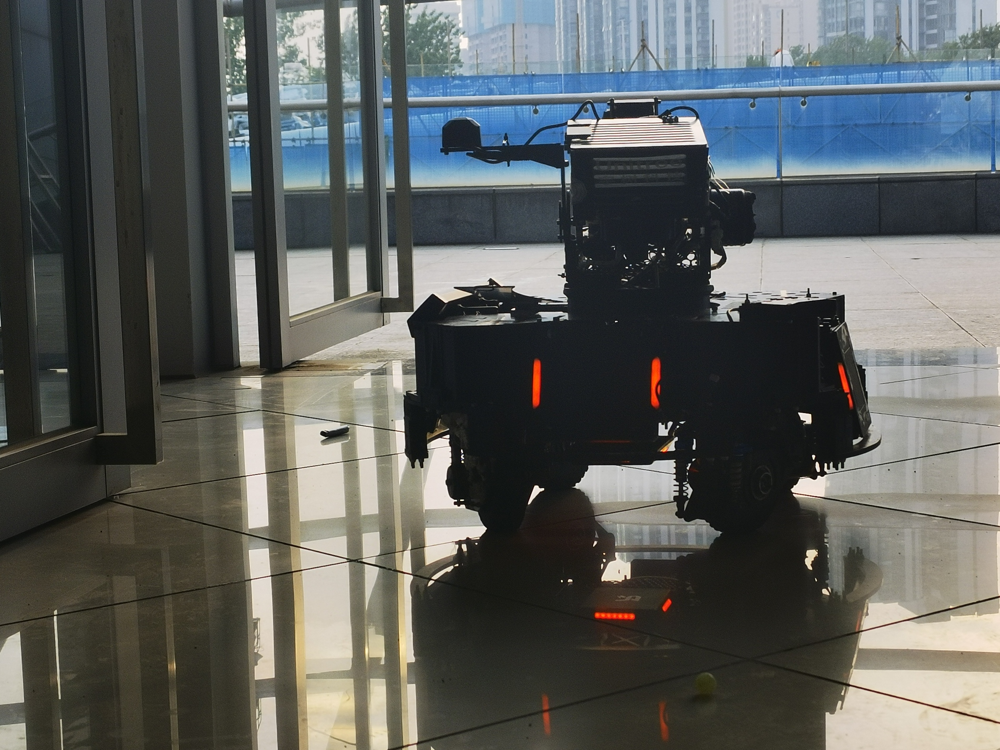
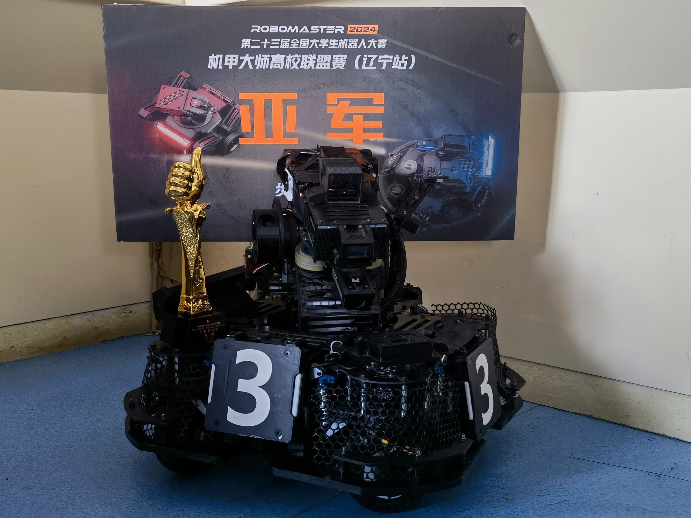
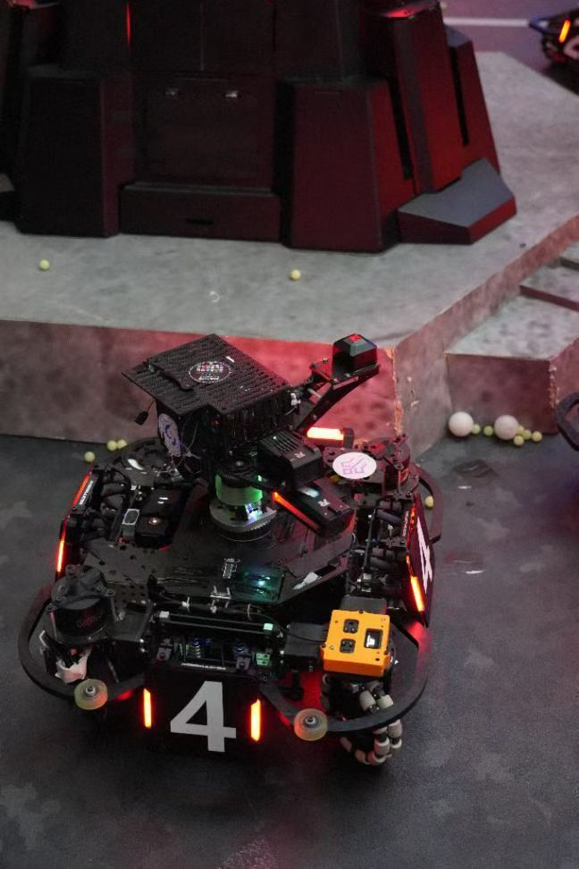
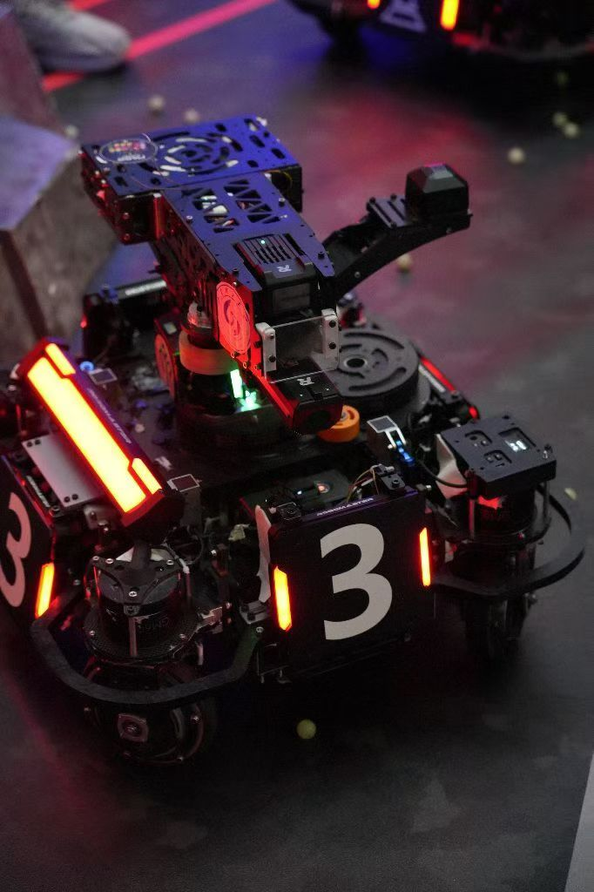
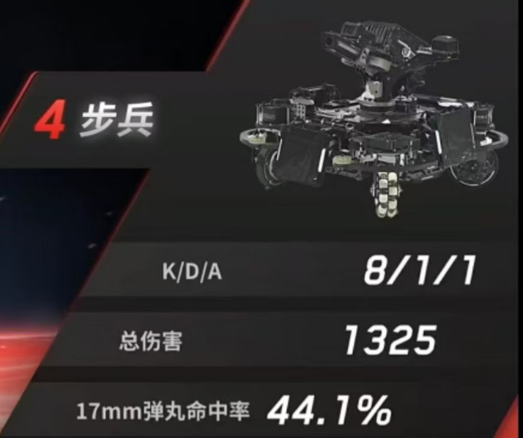
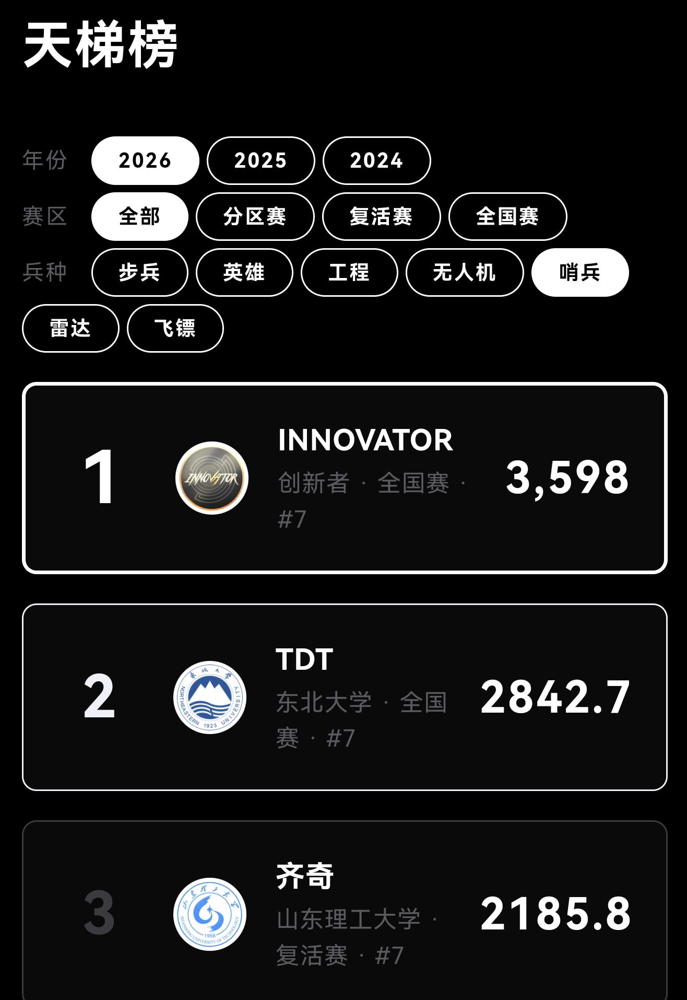
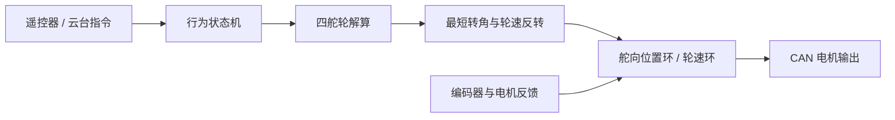

# Rudder Swerve Control

面向 RoboMaster 舵轮底盘的控制开源。该仓库只公开底盘运动学、控制状态机、CAN 电机接口及其必要算法，不包含整车业务、上位机、UI、裁判系统或完整板级工程。

## 项目背景与开源初衷

本人曾任山东理工大学齐奇战队 2023 赛季队长兼电控组组长。自 2023 至 2025 赛季，我持续参与舵轮底盘的研发、调试与维护；2025 年毕业后，仍以队伍成员的身份继续投入技术支持与赛季保障。

2026 赛季，我随队参与联盟赛、区域赛和复活赛。齐奇战队在这一赛季实现队史突破，闯入复活赛，距离全国赛仅一步之遥。这个仓库整理并公开了我们在舵轮底盘控制上的一部分实践：既希望为队伍留下可继续迭代的技术资产，也希望给后续尝试舵轮底盘的 RoboMaster 队伍提供一个可读、可移植的起点。

开源的不是一份“万能参数”，而是一套经过实车研发和维护沉淀的控制思路。不同底盘的机械尺寸、电机型号、编码器零位与功率策略各不相同，欢迎基于本项目验证、改进并分享你的结果。

## 实车与赛季记录

| 2023：舵轮底盘实车 | 2024：舵轮底盘实车 |
| --- | --- |
|  |  |

| 2025：半舵方案 | 2025：四舵方案 |
| --- | --- |
|  |  |

| 2025：步兵对局记录 | 2026：舵轮哨兵赛场 |
| --- | --- |
|  |  |

| 2026：哨兵天梯榜记录 |
| --- |
|  |

这些图片记录了舵轮方案从早期实车、不同机构形态到赛场应用的过程；它们用于展示研发与参赛背景，不替代可复现的控制测试数据。

> **安全提示**：首次上电请将机器人架空，确认四个舵向零位、轮组编号、CAN ID 与电机方向后再使能输出。

## 功能

- 四舵轮速度/方位角解算；
- 舵向最短路径、最优角与 `cos^3` 轮速补偿；
- 跟随云台、舵轮跟随、旋转及失能状态机；
- 舵向位置环、轮速环与功率控制接口；
- CAN 电机反馈与离线状态接口。

## 代码范围

| 路径 | 内容 |
| --- | --- |
| `firmware/User/Application` | 底盘任务、行为状态机、CAN 收发接口 |
| `firmware/User/algorithm` | PID、斜坡与通用数学工具 |
| `firmware/User/modules` | 电机数据结构与功率控制接口 |

这是从实车工程中抽取的控制层，不是开箱即烧录的完整固件。移植时须由使用者提供 STM32 HAL、FreeRTOS、IMU/云台反馈、裁判系统数据和电机 CAN 驱动；详见 [移植说明](docs/porting.md)。

相关文档：[控制算法](docs/control-algorithm.md)、[软件架构](docs/architecture.md)、[参数说明](docs/parameters.md)、[测试清单](docs/testing.md)。

## 控制链路

## 舵向优化

控制实现位于 [`chassis_task.c`](firmware/User/Application/src/chassis_task.c) 的 `Rudder_motor_relative_angle_control`：

1. 将舵向编码器误差折返到 `[-4096, 4096]`，即选择不超过 180° 的转动路径。
2. 当绝对误差超过 `2048`（90°）时，将目标等效旋转 180°，并把对应驱动轮速度置反；舵机最终只需转动不超过 90°，这是舵轮的最优角/就近原则。
3. 轮速乘以 `cos(error)^3`。舵轮尚未对准时，驱动轮速度被平滑压低；误差趋近 90° 时趋近零，以减小侧向拖拽。这里是三次余弦补偿，不是一次 `cos` 补偿。
4. 运动学解算使用单精度 `sqrtf/atan2f`，并复用 45° 旋转分量，减少 2 ms 控制周期内的重复三角函数和双精度运算。

编码器一圈按 8192 计数；移植到其他绝对编码器时，应同步修改零位、满量程和 90° 阈值。

## 硬件与环境

- 参考 MCU：STM32F407；
- 参考系统：FreeRTOS、STM32 HAL、CMSIS-DSP；
- 参考执行机构：4 个驱动电机 + 4 个舵向电机，经 CAN 通信；
- 轮径、轮距、零位编码器值和 CAN ID 均需按实物配置。

## 快速移植

1. 将 `firmware/User` 合并到自己的 STM32 工程并配置 include path。
2. 实现或适配 `CAN_cmd_rudder`、`CAN_cmd_chassis` 及电机反馈接口。
3. 在 `chassis_task.h` 配置四个舵机的编码器零位和 PID 初值。
4. 在 `chassis_task.c` 校准轮组半径、轮到中心距离、方位角和方向。
5. 架空底盘，依次验证单轮舵向、单轮驱动、平移、原地旋转与失联保护。

## 演示与参考资料

- [舵轮解算](https://www.bilibili.com/video/BV13p4y177HZ/)
- [飞坡视频](https://www.bilibili.com/video/BV1YET3zsEG1/)
- [对局效果](https://www.bilibili.com/video/BV1HXT4z7EcB/)
- [余弦优化](https://www.bilibili.com/video/BV11utSzqE4z/)
- [地形跨越](https://www.bilibili.com/video/BV1BF7NzzELk/)
- [能量效果](https://www.bilibili.com/video/BV1o5HfzYEaa/)

## 致谢

感谢学长夏QL、郭ZH、袁XN对初代舵轮研发的帮助；感谢搭档王H、梁YQ、袁QB，愿意在队伍资源最紧张的一年并肩作战。感谢学弟李HZ、陈HR、李ZH、邱YP、刘YM继续接手并维护舵轮方案，让这套技术得以传承。

特别感谢滕SY、徐J两位学弟：齐奇战队如今轻量化、实用的自适应舵轮结构，离不开你们的持续投入。也感谢蒙YW（RM Award 候选人）在超级电容方案上的贡献与支持。

也期待未来的学弟学妹继续加油，齐心协力，在齐奇战队写下属于自己的新奇迹。

## 许可证

本仓库中由发布者拥有著作权的原创代码采用 [MIT License](LICENSE)。如引入第三方 SDK、库或历史代码，使用前须确认其许可证与署名要求；它们不因本许可证而被重新授权。
